# Sesión 2_BEDU: Agrupaciones y subconsultas. 
En esta sesión se realizaron los siguientes retos:
## :pushpin: Reto 1. Búsqueda de patrones mediante LIKE. 

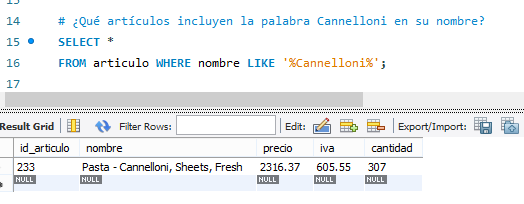
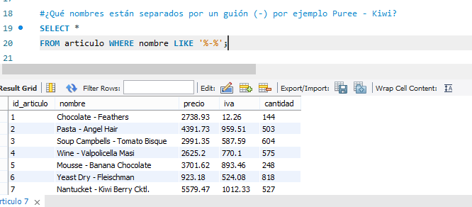
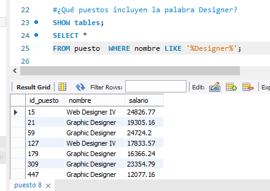
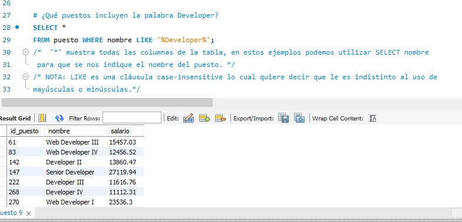
## :pushpin: Reto 2. Funciones de agrupamiento.

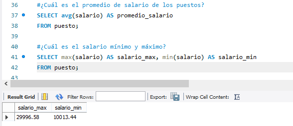
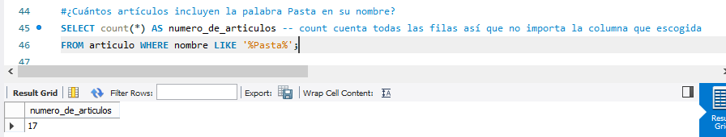
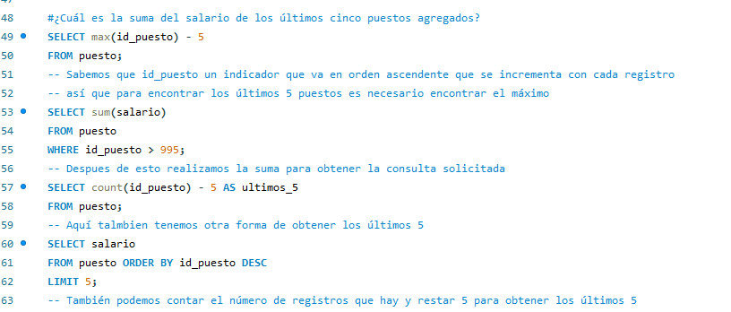

## :pushpin: Reto 3. Agrupamientos.
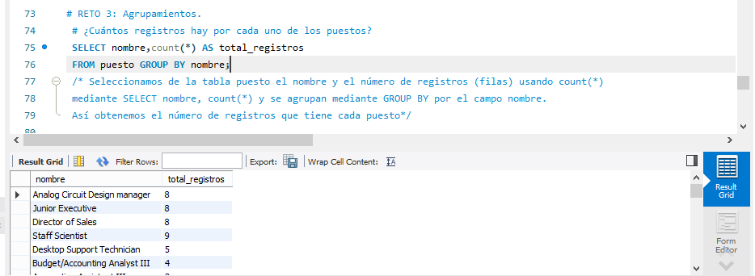
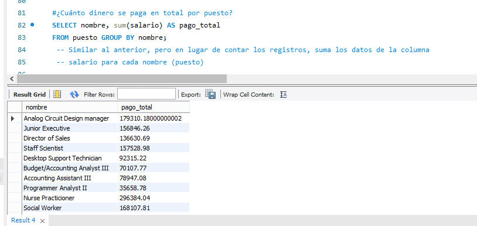
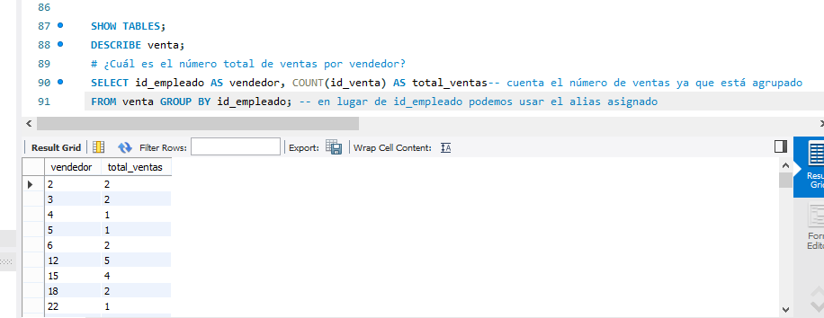
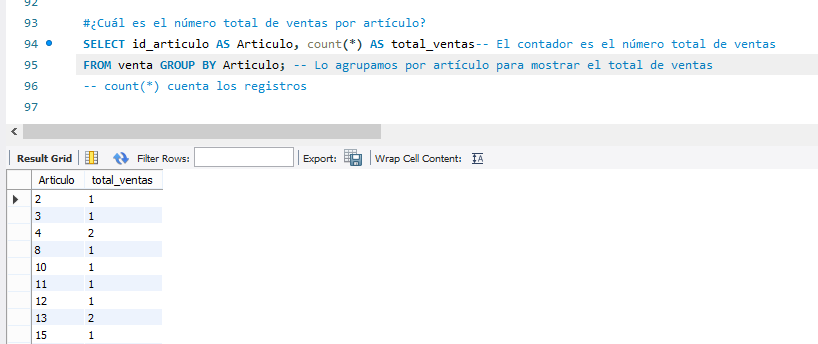
